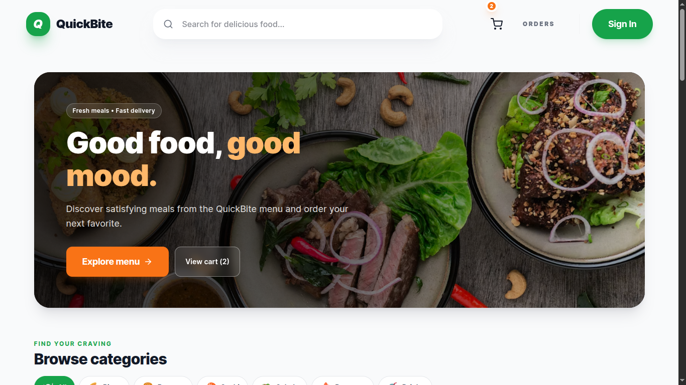
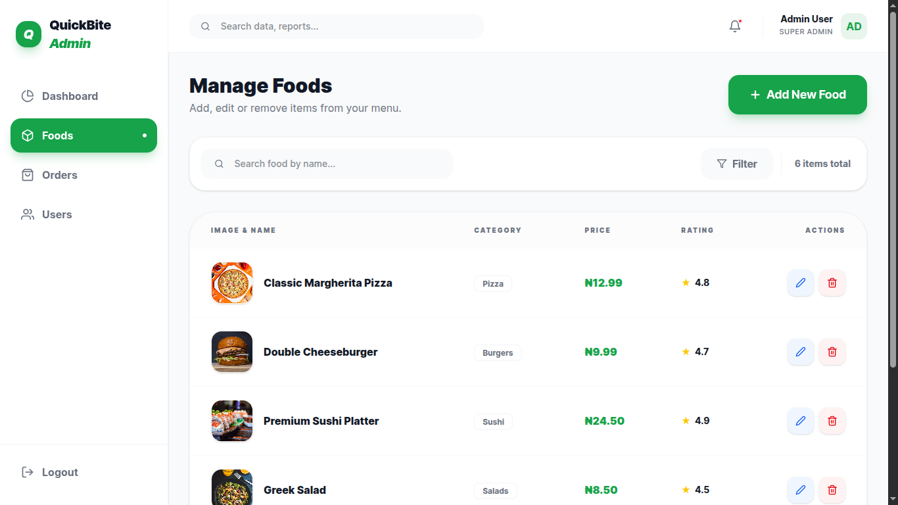
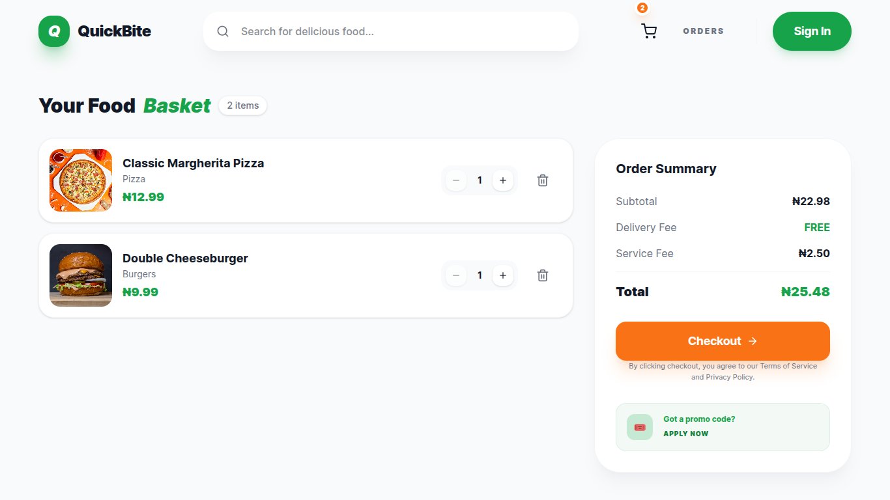
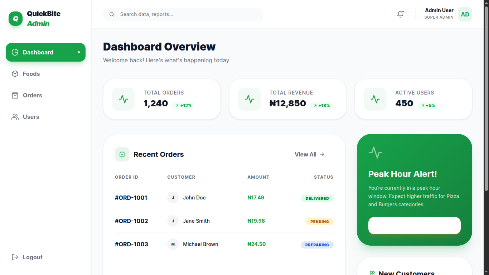

<div align="center">

  <h1>🍔 QuickBite – Food Ordering Web App</h1>
  <p><strong>A modern, lightning-fast food delivery platform built with React, Vite, and Tailwind CSS.</strong></p>

  <p>
    
    
    
    
  </p>

</div>

---

## 🌟 Overview

**QuickBite** is a fully-featured, responsive food ordering application designed to deliver an exceptional user experience. Whether users are craving a quick snack or a full meal, QuickBite provides smooth category filtering, interactive cart management, real-time order tracking, and a powerful **Admin Dashboard** for complete menu and order control.

---

## 🚀 Key Features

### 👤 Customer Experience

- 🍔 **Rich Menu Exploration:** Browse food items categorized by cuisine with high-resolution imagery, ratings, and pricing.
- 🔍 **Live Search & Filtering:** Instantly search for dishes by name or filter items by category.
- 🛒 **Interactive Cart & Checkout:** Seamlessly update cart quantities, calculate totals, and place orders.
- 📦 **Order Tracking:** Track order progress (`Pending`, `Preparing`, `Delivered`) and view detailed order history.
- 📱 **Responsive Mobile-First Design:** Optimized for smartphones, tablets, and desktop displays.

### 🛠️ Admin Panel Control

- 📊 **Dashboard Overview:** Real-time metrics tracking total orders, revenue, and customer registrations.
- 🍕 **Menu Management:** Add, edit, or remove food items directly from the admin dashboard with modal support.
- 🚚 **Order Management:** Review incoming orders, update live order statuses instantly, and filter logs.
- 🔒 **Protected Authentication:** Role-based routing to keep management secure.

---

## 🖼️ Screenshots

<div align="center">

|              Homepage               |             Food Listing              |
| :---------------------------------: | :-----------------------------------: |
|  |  |
|            **Cart Page**            |          **Admin Dashboard**          |
|      |      |

</div>

---

## 🧠 Tech Stack

### Frontend

- **React (Vite)** – Fast component-based UI rendering
- **Tailwind CSS** – Modern, utility-first styling with custom design tokens
- **React Router** – Seamless client-side page routing
- **Framer Motion** – Smooth page transitions and micro-animations
- **React Icons** – Clean icon set integration
- **Context API** – Global state management for authentication and cart state

### Backend (Future / MERN Integration)

- **Node.js & Express.js** – RESTful API architecture
- **MongoDB & Mongoose** – NoSQL database for users, menus, and orders

---

## 🎨 Design & Color Palette

QuickBite follows a modern aesthetic inspired by industry-leading food delivery services.

- **Primary (`#16A34A`):** Vibrant green used for success indicators, active states, and primary actions.
- **Accent (`#F97316`):** Warm orange used for highlights, badges, and attention points.
- **Background (`#F9FAFB`):** Soft neutral base for high readability.
- **Text (`#111827`):** Dark slate for clean typography contrast.

---

## 📂 Project Structure

```tree
quickbite/
├── public/
├── screenshots/          # App screenshots for documentation
├── src/
│   ├── assets/           # Images, icons, and static assets
│   ├── components/       # Reusable UI components (Navbar, Button, Modals)
│   ├── context/          # React Context (AuthContext, CartContext)
│   ├── data/             # Dummy data and mock database sources
│   ├── pages/            # View pages (Dashboard, Orders, Admin Views)
│   ├── App.jsx           # Main router & root component
│   └── main.jsx          # Application entry point
├── tailwind.config.js    # Tailwind CSS custom theme configurations
└── package.json          # Dependencies and scripts
```
